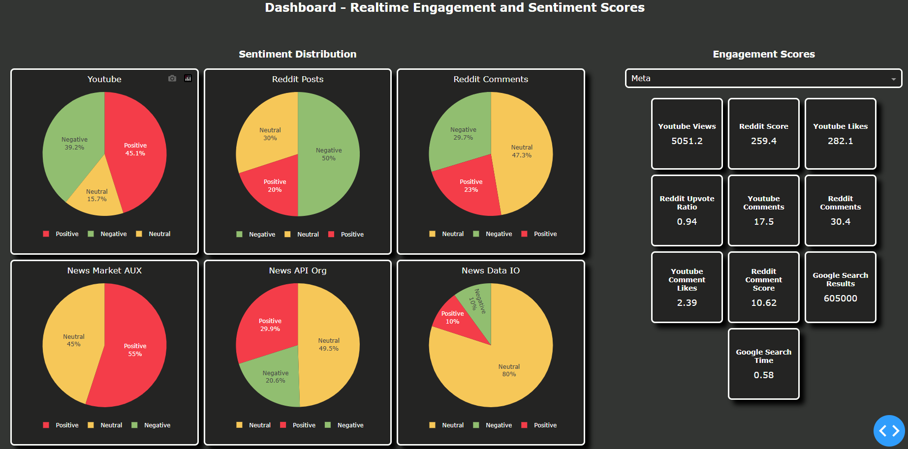

# Intro
We perform sentiment analysis for trading.

## Problem
We want to trade popular stocks that relate to ai tech companies. We are interested in sentiment analysis.

## Proposed Solution
1. Get data from different sources and store them in a data lake and in a datawarehouse.<br>
2. Calculate sentiment with Bert.
3. Calculate engagement metrics.
4. Build a dashboard that displays sentiment analysis scores and engagement of each stock for each platform separately.<br>


# Data Sources:
1. Youtube API
2. Reddit API (Prawn)
3. Google Search
4. News Data API - https://newsdata.io/
5. News API - https://newsapi.org/
6. Market Aux API - https://www.marketaux.com/


# KPIs / Metrics
We search the company name and related queries on these platforms and use the results in the following manner:
1. Engagement<br>
    1. Youtube<br>
        1. List Searched Videos: Avg Views<br>
        2. List Searched Videos: Avg Likes<br>
        3. List Searched Videos: Avg Comments<br>
        4. List Searched Videos: Avg Comment Likes<br>

    2. Reddit<br>
        1. List Searched Post: Avg Score<br>
        2. List Searched Post: Avg Upvote Ratio<br>
        3. List Searched Post: Avg Comments<br>
        4. List Searched Post: Avg Comment Score<br>

    3. Google Search<br>
        1. Search Result: Count<br>
        2. Format Time<br>

2. Sentiment<br>
    1. Youtube<br>
        1. Positive or negative sentiment<br>
            1. Titles + Descriptions<br>
            2. Comments<br>

    2. Reddit<br>
        1. Searched<br>
            1. Positive or negative sentiment<br>
                1. Titles + Descriptions<br>
                2. Comments<br>

    3. Market Aux API<br>
        1. Positive or negative sentiment<br>
            1. Titles + Descriptions<br>
            2. API's Sentiment Score<br>

    4. News API Org<br>
        1. Positive or negative sentiment<br>
            1. Titles + Descriptions<br>

    5. News Data IO<br>
        1. Positive or negative sentiment<br>
            1. Titles + Descriptions<br>

    6. Google Search<br>
        1. Positive or negative sentiment<br>
            1. Link Titles<br>


# Tools Used:
1. APIs listed below
2. Duckdb
3. BERT
4. Plotly Express
5. Plotly Dash
6. Pandas


# How to run:
1. Configure Project:
```
python -m venv .localenv
.localenv\Scripts\python -m pip install -r ./requirements.txt
```

2. Use
    1. Extract Data
    ```
    .localenv\Scripts\python -m src.scripts.extract
    ```
    2. Transform Data
    ```
    .localenv\Scripts\python -m src.scripts.transform
    ```
    3. Dashboard
    ```
    .localenv\Scripts\python -m src.dashboard.dashboard
    ```


# Keys
Put the `.env` file in `./keys/.env`:

```
project
├───keys
    └───.env
```

```
URL=http://localhost
PORT=8080

# Youtube
YOUTUBE_API_KEY=
PATH_TO_SECRET=
YPATH_TO_TOKEN=

# Reddit
REDDIT_CLIENT_ID=
REDDIT_CLIENT_SECRET=
REDDIT_USER_AGENT=
REDDIT_USERNAME=
REDDIT_PASSWORD=
RPATH_TO_TOKEN=

# Google
GOOGLE_API_KEY=
GOOGLE_SEARCH_ENGINE_ID=

# NewsDataIO
NEWS_DATA_IO_API_KEY=

# NewsApiOrg
NEWS_API_ORG_API_KEY=

# MarketAux
MARKET_AUX_API_KEY=
```