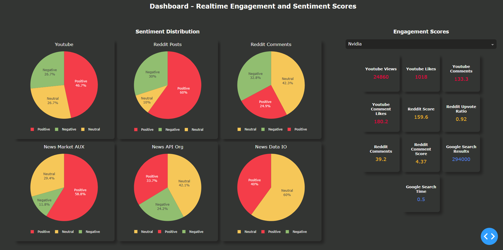

# Intro

In this project we take data from several apis listed below in data section, and then find 1. engagement and 2. sentiment score. Finally we display them in a dashboard made in Plotly Dash. 
The project covers apis, datalake+datawarehouse schemas in duckdb and uses the (extract, transform, load) approach to automate the process. So we can get daily, weekly or monthly (our choice) 
of updates. 
There are also tests to make sure that the apis have not broken, in the case that api changes, our program does not break. 

 
!!! Please put keys folder in .gitignore before starting.
 
 

# Dashboard Screen Shots
## 1

## 2

# Proposal Version 1: Engagement Metrics Dashboard

With a mindset to create value first instead of diving into deeper uncharted analysis.
1. First we will first focus on basic kpi and metric building.
2. We will collect data to fill these kpis and metrics in a time series fashion.
3. A dashboard will be created to highlight and showcase these kpis and metrics.

# Tools:
1. APIs listed below
2. Duckdb
3. Plotly Express
4. Plotly Dash
5. Pandas

# Data
We will be sourcing our data primarily through apis and past data sources.
The apis will help us for new data predictions.
The past data will be used for training.

We will use these sources for our data: 
1. Youtube API
2. Reddit API (Prawn)
3. Google Search
4. News Data API - https://newsdata.io/
5. News API - https://newsapi.org/
6. Market Aux API - https://www.marketaux.com/
7. News DataHub API - https://newsdatahub.com/
    Their servers are down, will reattempt after they are live.
8. Pyprojects - https://pypi.org/project/pytrends/
    Not an official api and does not work without proper proxy, session and header setup. Hence not used.
9. Newspaper3k - https://newspaper.readthedocs.io/en/latest/
    Not an official api and does not work without proper proxy, session and header setup. Hence not used.

# Metrics

It will have these sections:
1. Engagement 
    1. Youtube 
        1. List Searched Videos: Avg Views 
        2. List Searched Videos: Avg Likes 
        3. List Searched Videos: Avg Comments 
        4. List Searched Videos: Avg Comment Likes 

    2. Reddit 
        1. List Searched Post: Avg Score 
        2. List Searched Post: Avg Upvote Ratio 
        3. List Searched Post: Avg Comments 
        4. List Searched Post: Avg Comment Score 

    3. Google Search 
        1. Search Result: Count 
        2. Format Time 

2. Sentiment 
    1. Youtube 
        a. Positive or negative sentiment 
            i. Titles + Descriptions 
            ii. Comments 

    2. Reddit 
        a. Searched 
            i. Positive or negative sentiment 
                (1) Titles + Descriptions 
                (2) Comments 

    3. Market Aux API 
        a. Positive or negative sentiment 
            i. Titles + Descriptions 
            ii. API's Sentiment Score 

    4. News API Org 
        a. Positive or negative sentiment 
            i. Titles + Descriptions 

    5. News Data IO 
        a. Positive or negative sentiment 
            i. Titles + Descriptions 

    6. Google Search 
        a. Positive or negative sentiment 
            i. Link Titles 